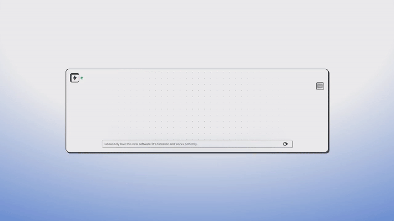

<div align="center"></div>

<div align="center">
  
      

<!-- Tweet Dataset Badges -->


<!-- Amazon Dataset Badges -->


</div>


# Transformer from Scratch for Emotion Classification

<div align="center">
  <a href="https://www.youtube.com/watch?v=Nl3SReW8KgY">
    
  </a>
  
</div>

<div align="center">
  Click to view Demo video on youtube
</div>

---

## Content Navigation

- [Project Overview](#transformer-from-scratch-for-emotion-classification)  
- [Project Structure](#project-structure)  
- [Model Overview](#model-overview)  
- [Dataset](#dataset)  
- [Training & Fine-tuning](#training--fine-tuning)  
- [Model Performance](#model-performance)  
- [API Usage](#api-usage)


---

This repository demonstrates a **Transformer-Encoder-based sequence classification model built from scratch** in PyTorch. The model is pre-trained on the [`tweet_eval`](https://huggingface.co/datasets/tweet_eval) dataset for **emotion classification**, including labels like *anger, joy, optimism, sadness, fear,* and *love*.

Further, this model is fine-tuned on the [`Amazaon Review Sentiment`](https://huggingface.co/datasets/hungnm/multilingual-amazon-review-sentiment-processed) dataset for **binary classification** including labels as *negative and positive*

---

## Project Structure
```
.
├── Architectures/                        # Model architectures
│   └── Basic_Sequence_classification.py
├── layers/                               # Custom Transformer layers
│   ├── attention.py
│   ├── embedding.py
│   ├── encoderlayer.py
│   └── feedforward.py
├── best_model.pt                         # Saved PyTorch model
├── fine_tune.ipynb                       # Fine-tuning notebook
├── trainer.ipynb                         # Training script/notebook
├── finetuned-assistant/                 # (Optional) Related outputs or helper modules
├── wandb/                                # Weights & Biases logs (if used)
└── README.md                             # Project description
```
---

## Model Overview

The model [`Transformer_For_Sequence_Classification2`](Architectures/Basic_Sequence_classification.py) is a custom implementation resembling the BERT architecture, composed of:

- **Token Embedding**: Converts token IDs to dense vectors.
- **Positional Encoding**: Adds sequence order information.
- **Transformer Encoder**: Custom multi-head self-attention encoder stack.
- **Dropout Layer**
- **Classification Head**: Maps pooled embedding to 6 emotion classes.

You can find the individual building blocks in the [`layers/`](layers) directory.

---

## Dataset

- **Dataset**: [`tweet_eval`](https://huggingface.co/datasets/tweet_eval)
- **Task**: Emotion classification
- **Classes**: `anger`, `joy`, `optimism`, `sadness`, `fear`, `love`
- **Source**: Twitter

```python
from datasets import load_dataset
dataset = load_dataset("tweet_eval", "emotion")
```
## Training & Fine-tuning

Use the provided notebooks:

- `trainer.ipynb`: Contains the training loop, evaluation, and logging. See More in [Notebook](trainer.ipynb)
- `fine_tune.ipynb`: Fine-tune the model on the `tweet_eval` dataset. See More in [Notebook](finetune.ipynb)

You can save the model using:

```python
torch.save(model.state_dict(), "best_model.pt")
```

## Model Performance

| Dataset            | Training Type | Accuracy | F1-Score |
|--------------------|---------------|----------|----------|
| Tweet Dataset      | From Scratch  | 65.5%    | 60.3%    |
| Amazon Reviews     | Fine-tuned    | 89.1%    | 88.8%    |

**Overall improvement in customer sentiment analysis efficiency: +28.5%**


## API Usage

Check if API is Healthy - Don't Misuse it
```bash
curl -X GET https://sentiment-analyzer-hm69.onrender.com
```
```bash
{"message":"Sentiment analysis model is up and running! Have a great Day XD"}%                                     
```
Example Usage
```bash
curl -X POST https://sentiment-analyzer-hm69.onrender.com/predict \
  -H "Content-Type: application/json" \
  -d '{"review": "This product is amazing!"}'
```
```bash
{"Negative":0.00019336487457621843,"Positive":0.9998067021369934}
```
